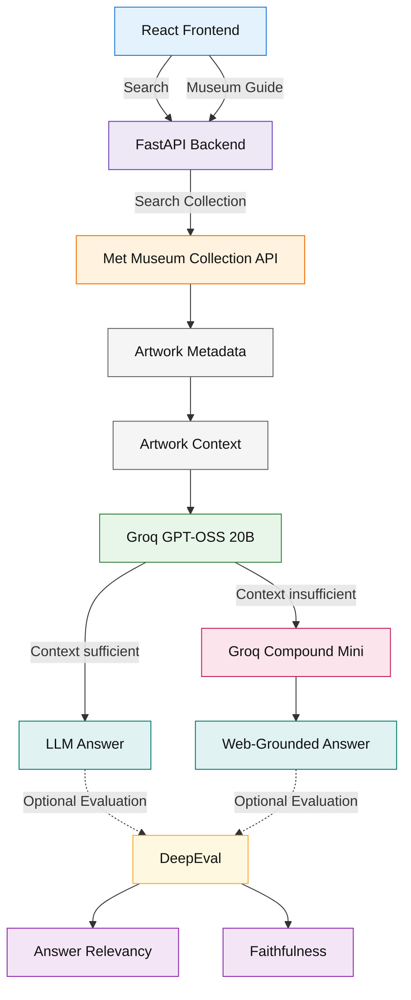
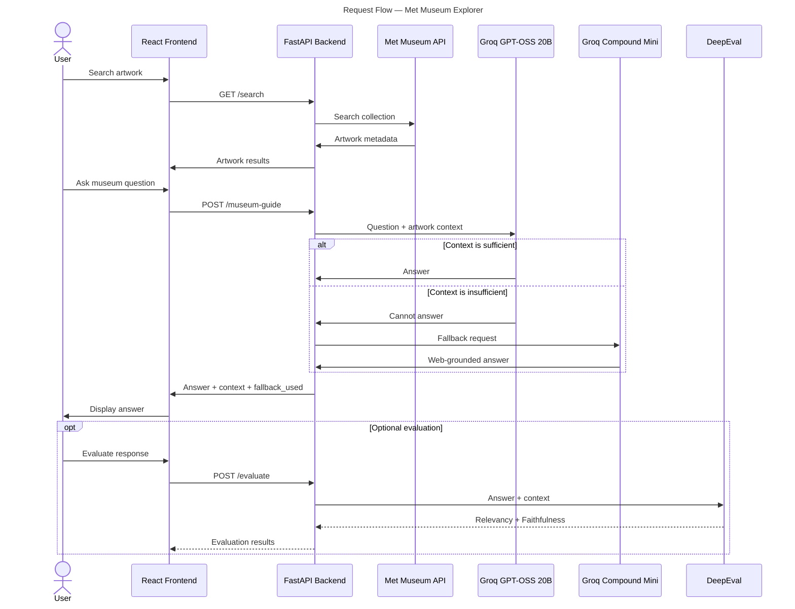

# Met Museum Explorer

A full-stack museum collection explorer built with **React** and
**FastAPI**, using the Metropolitan Museum of Art Collection API and a
Groq-powered LLM Museum Guide.

The Museum Guide uses the Met Museum artwork context as its primary
source. When that context is insufficient, the application falls back to
**Groq Compound Mini with web search** to retrieve additional
information.

## ✨ Features

- 🔎 Search the Met Museum collection
- 🎨 Artist-based filtering
- 🖼️ Artwork images and metadata
- ➕ Progressive **Load More** results
- ⚡ Backend batching and caching
- 🛡️ Controlled requests to the external API
- 🤖 LLM-powered **Museum Guide**
- 💬 Ask questions about the currently retrieved artworks
- 🧠 Conversation history in the Museum Guide
- 📝 Markdown-rendered LLM responses
- 🌐 Context-aware web-search fallback
- 🔎 Explicit `fallback_used` tracking
- 🧪 LLM evaluation with **DeepEval**
- 🎯 Answer Relevancy and Faithfulness evaluation

## Tech Stack

-   **Frontend:** React, Vite, JavaScript, CSS
-   **Backend:** Python, FastAPI, HTTPX, Pydantic
-   **LLM:** Groq GPT-OSS 20B
-   **LLM Fallback:** Groq Compound Mini + web search
-   **LLM Evaluation:** DeepEval
-   **Museum API:** Metropolitan Museum of Art Collection API

## Architecture

**Author:** Sachin Prabhu B | **Version:** 1.0



### Sequence Diagram
**Author:** Sachin Prabhu B | **Version:** 1.0

**Diagram notation:**

- **Solid arrows** → Core application flow
- **Dotted arrows** → Optional evaluation flow using DeepEval



## 🖼️ Museum Guide

The Museum Guide uses the artwork results already retrieved from the Met
Museum API.

For example:

``` text
Search
  ↓
vincent
  ↓
Met Museum results
  ↓
Artwork context
  ↓
Groq GPT-OSS 20B
```

When the user asks a question, the frontend sends only the question to:

``` text
POST /museum-guide
```

The backend combines the question with the currently retrieved artwork
context before sending it to the LLM.

This allows questions such as:

``` text
Which Vincent van Gogh artworks are in these Met Museum results?
```

or:

``` text
Which of these artworks are tagged as still lifes?
```

The Museum Guide is displayed only after search results are available.

## 🔎 LLM Fallback

The primary LLM is intentionally constrained to the retrieved Met Museum
artwork context.

If Groq cannot answer from that context, the backend detects the
insufficient-context response and triggers a fallback using **Groq
Compound Mini** with web search.

The fallback prompt also instructs the model to identify the relevant
artwork from the supplied Met context when the question is a follow-up
question.

The API records whether the fallback was used:

``` json
{
  "answer": "...",
  "context": "...",
  "fallback_used": true
}
```

A normal Met-grounded response returns:

``` json
{
  "fallback_used": false
}
```

This makes the two answer paths observable for debugging and evaluation.

## 🧪 LLM Evaluation

The generated Museum Guide response is evaluated in the backend using
DeepEval.

Currently, the system evaluates:

### Answer Relevancy

Measures whether the generated answer is relevant to the user's
question.

### Faithfulness

Measures whether the generated answer is supported by the supplied
retrieval context.

The evaluation uses the context supplied to the Museum Guide:

``` text
Met Museum artwork data
        ↓
   retrieval_context
        ↓
      DeepEval
        ↓
Answer Relevancy
Faithfulness
```

Example evaluation from the Vincent van Gogh fallback test case:

``` text
Answer Relevancy | score=1.000
Faithfulness     | score=1.000
```

These scores represent a specific test run and are not intended to
represent universal system performance.

A traditional retrieval **precision** score has not been calculated yet.
A proper retrieval evaluation would require a labeled question/document
dataset and metrics such as Precision@k, Recall@k, and MRR.

Evaluation results are currently written to the backend terminal logs.

### Search and Progressive Loading

The backend searches the Met Museum collection and retrieves artwork
metadata in controlled batches.

For example, searching for:

``` text
vincent
```

returns candidate object IDs from the Met API. The backend processes
these in batches and returns matching artwork records to the frontend.

The frontend supports progressive loading using **Load More**.

## 🚀 Running

### Backend

``` bash
cd backend
uv run uvicorn main:app --reload
```

API:

``` text
http://localhost:8000
```

Swagger:

``` text
http://localhost:8000/docs
```

### Frontend

``` bash
cd frontend
npm install
npm run dev
```

Frontend:

``` text
http://localhost:5173
```

## 🔐 Environment Variables

Backend environment variables are stored locally in:

``` text
backend/.env
```

An example configuration is provided in:

``` text
backend/.env.example
```

The Groq API key is kept on the backend and is never exposed to the
React frontend.

The frontend uses:

``` text
VITE_API_URL
```

for the backend API URL.

Do not commit `.env` or API keys to source control.

### Example

Searching for `vincent` returns 193 candidate objects from the Met API.

Results are loaded progressively:

``` text
0–69     → 5 matches
70–139   → 5 matches
140–192  → 0 matches
```

The search returns 10 Vincent van Gogh artworks in total.

A question that can be answered from the Met metadata follows the
primary path:

``` text
Met context → Groq → answer
```

For example:

``` text
When was Wheat Field with Cypresses made?
```

A question requiring information beyond the retrieved metadata can
trigger the fallback:

``` text
Met context
    ↓
Groq cannot answer
    ↓
Groq Compound Mini
    ↓
Web Search
    ↓
answer
```

For the tested question:

``` text
What inspired Vincent van Gogh to paint Wheat Field with Cypresses?
```

the fallback was successfully triggered and returned a web-grounded
answer in approximately 8 seconds during testing.

### Project Structure

``` text
met-museum-explorer/
│
├── backend/
│   ├── main.py
│   ├── schemas.py
│   ├── service.py
│   ├── llm_service.py
│   ├── evaluation.py
│   ├── pyproject.toml
│   ├── uv.lock
│   └── .env.example
│
└── frontend/
    ├── src/
    │   ├── App.jsx
    │   └── api/
    │       └── museum.js
    ├── index.html
    ├── package.json
    └── package-lock.json
```

### Notes

The backend processes requests in controlled batches and caches
retrieved artwork records to reduce repeated API calls and avoid
excessive requests to the Met Museum API.

The LLM operates on the artwork context retrieved by the backend rather
than making an independent museum search for every question.

When the primary context is insufficient, Groq Compound Mini provides a
web-search fallback.

DeepEval runs on the backend and currently reports evaluation metrics in
the terminal.

The fallback path and evaluation scores are intended to make the
system's behavior observable rather than presenting all answers as if
they came directly from the Met Museum API.
